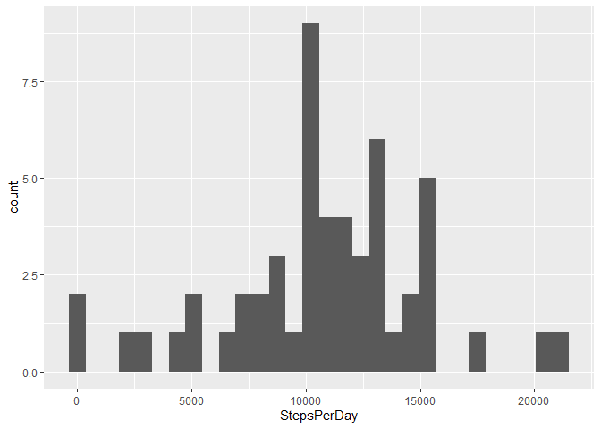
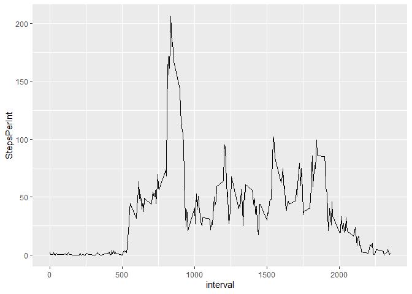
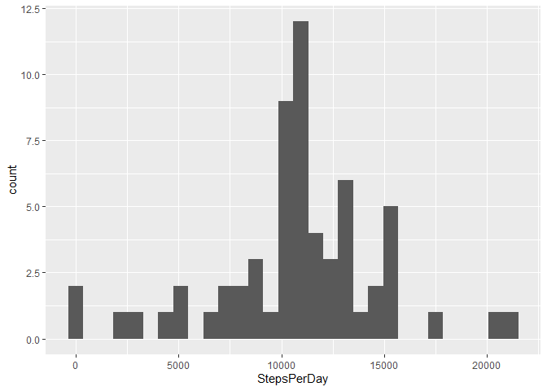
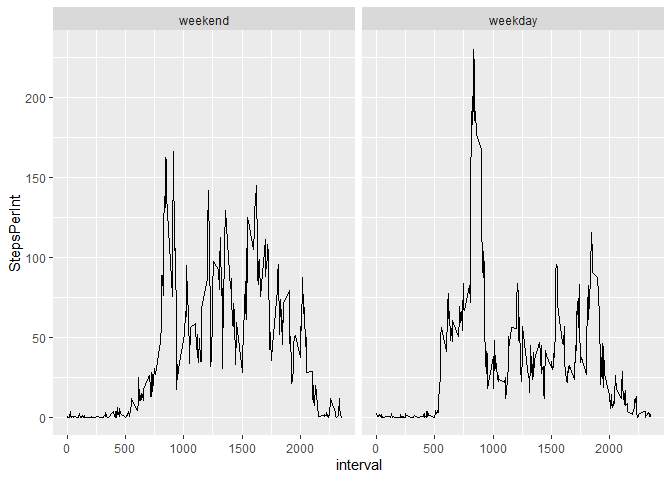

## Loading and preprocessing the data

Show any code that is needed to

1. Load the data (i.e. read.csv())

See code below.

2. Process/transform the data (if necessary) into a format suitable for your
analysis

No further processing done.

###Code

```r
library(tidyverse)
```

```
## -- Attaching packages ------------------------------------- tidyverse 1.3.0 --
```

```
## v ggplot2 3.3.1     v purrr   0.3.4
## v tibble  3.0.1     v dplyr   0.8.5
## v tidyr   1.0.2     v stringr 1.4.0
## v readr   1.3.1     v forcats 0.5.0
```

```
## -- Conflicts ---------------------------------------- tidyverse_conflicts() --
## x dplyr::filter() masks stats::filter()
## x dplyr::lag()    masks stats::lag()
```

```r
#Read file
activity <- read.csv("activity.csv", header=TRUE)
View(activity)

#To get structure and head file
#str(activity)
#head(activity)
```


## What is mean total number of steps taken per day?

For this part of the assignment, you can ignore the missing values in the dataset.

1. Make a histogram of the total number of steps taken each day

See histogram below.

2. Calculate and report the mean and median total number of steps taken
per day

Mean: 10766.19 mean total steps per day

Median: 10765 median total steps per day

###Code

```r
#To get sums by date

actSum <- activity %>% filter(steps, !is.na(steps)) %>% group_by(date, add=F) %>% summarize(StepsPerDay = sum(steps, na.rm=TRUE)) 
actSum
```

```
## # A tibble: 53 x 2
##    date       StepsPerDay
##    <fct>            <int>
##  1 2012-10-02         126
##  2 2012-10-03       11352
##  3 2012-10-04       12116
##  4 2012-10-05       13294
##  5 2012-10-06       15420
##  6 2012-10-07       11015
##  7 2012-10-09       12811
##  8 2012-10-10        9900
##  9 2012-10-11       10304
## 10 2012-10-12       17382
## # ... with 43 more rows
```

```r
View(actSum)

#Total number of days
length(actSum$date) ##Extra info
```

```
## [1] 53
```

```r
#Histogram in ggplot 

##To get counts for number of steps per day in each bin (default bin = 30; not a barplot)


ggplot(data = actSum, mapping = aes(x = StepsPerDay)) + geom_histogram()
```

```
## `stat_bin()` using `bins = 30`. Pick better value with `binwidth`.
```

<!-- -->

```r
#Mean total steps per day 

meanTotal <- actSum %>% summarize(MeanSteps = mean(StepsPerDay))
meanTotal
```

```
## # A tibble: 1 x 1
##   MeanSteps
##       <dbl>
## 1    10766.
```

```r
#Median total steps per day
medTotal <- actSum %>% summarize(MedianSteps = median(StepsPerDay))
medTotal
```

```
## # A tibble: 1 x 1
##   MedianSteps
##         <int>
## 1       10765
```


## What is the average daily activity pattern?

1. Make a time series plot (i.e. type = "l") of the 5-minute interval (x-axis)
and the average number of steps taken, averaged across all days (y-axis)

See time series plot below.

2. Which 5-minute interval, on average across all the days in the dataset,
contains the maximum number of steps?

Max steps interval: 835, the 5 minute interval starting at 8:35am


###Code

```r
#Mean per interval
MeanActInt <- activity %>% group_by(interval) %>% summarize(StepsPerInt = mean(steps, na.rm=T)) 
MeanActInt
```

```
## # A tibble: 288 x 2
##    interval StepsPerInt
##       <int>       <dbl>
##  1        0      1.72  
##  2        5      0.340 
##  3       10      0.132 
##  4       15      0.151 
##  5       20      0.0755
##  6       25      2.09  
##  7       30      0.528 
##  8       35      0.868 
##  9       40      0     
## 10       45      1.47  
## # ... with 278 more rows
```

```r
#Total number of intervals
length(MeanActInt$interval) ##Extra info
```

```
## [1] 288
```

```r
#Max Interval 

##By arranging in descending order and slicing first rowthis worked to put in descending order and then slice
MaxInt <- MeanActInt %>% arrange(desc(StepsPerInt)) %>% slice(1)
MaxInt
```

```
## # A tibble: 1 x 2
##   interval StepsPerInt
##      <int>       <dbl>
## 1      835        206.
```

```r
#Time Series Plots

##Lubridate not needed here, 24hr day broken into 288 x 5m intervals

ggplot(data = MeanActInt, mapping = aes(x = interval, y = StepsPerInt)) + geom_line()
```

<!-- -->


## Imputing missing values

Note that there are a number of days/intervals where there are missing values
(coded as NA). The presence of missing days may introduce bias into some
calculations or summaries of the data.

1. Calculate and report the total number of missing values in the dataset
(i.e. the total number of rows with NAs)

Total number of NAs: 2304

2. Devise a strategy for filling in all of the missing values in the dataset. The
strategy does not need to be sophisticated. For example, you could use
the mean/median for that day, or the mean for that 5-minute interval, etc.

Imputed NAs using the mean for each 5min interval. See code below.

3. Create a new dataset that is equal to the original dataset but with the
missing data filled in.

See code below. The "final" dataframe has NA imputed with average steps per interval, see "SteapsImput" column.

4. Make a histogram of the total number of steps taken each day and Calculate
and report the mean and median total number of steps taken per day. Do
these values differ from the estimates from the first part of the assignment?
What is the impact of imputing missing data on the estimates of the total
daily number of steps?

See histogram and code below.

Mean with imputation: 10766.19 mean total steps per day

Median with imputation: 10766.19 median total steps per day

The result of imputation is alignment of the mean with the median.


###Code

```r
#Calculate and report the total number of missing values in the data set

sum(is.na(activity$steps)) ##2304 missing values
```

```
## [1] 2304
```

```r
##Extra info
length(activity$steps) ##17568 total
```

```
## [1] 17568
```

```r
sum(!is.na(activity$steps)) ##15264 non-NAs
```

```
## [1] 15264
```

```r
#Imputation with mean per interval

##From above 
#MeanActInt <- activity %>% group_by(interval) %>% summarize(StepsPerInt = mean(steps, na.rm=T)) 
#MeanActInt

#Total number of intervals
#length(MeanActInt$interval) ##288 5min intervals

#Total number of days
#length(actSum$date) ##61 days

#Repeat for number of days and combine in one data frame
dat <- data.frame() ##creates an empty data frame
        for (i in 1:61) {                                
                ##loops through the files, rbind each file together 
                dat <- rbind(dat, MeanActInt)
        }
head(dat)
```

```
## # A tibble: 6 x 2
##   interval StepsPerInt
##      <int>       <dbl>
## 1        0      1.72  
## 2        5      0.340 
## 3       10      0.132 
## 4       15      0.151 
## 5       20      0.0755
## 6       25      2.09
```

```r
#Combine datasets 

##Be careful about alignment of datasets

bind <- bind_cols(activity,dat)
head(bind)
```

```
##   steps       date interval interval1 StepsPerInt
## 1    NA 2012-10-01        0         0   1.7169811
## 2    NA 2012-10-01        5         5   0.3396226
## 3    NA 2012-10-01       10        10   0.1320755
## 4    NA 2012-10-01       15        15   0.1509434
## 5    NA 2012-10-01       20        20   0.0754717
## 6    NA 2012-10-01       25        25   2.0943396
```

```r
View(bind)

#Replace NA with interval mean
replaceNA <- bind %>% mutate(StepsImput = ifelse(is.na(steps), StepsPerInt, steps))
head(replaceNA)
```

```
##   steps       date interval interval1 StepsPerInt StepsImput
## 1    NA 2012-10-01        0         0   1.7169811  1.7169811
## 2    NA 2012-10-01        5         5   0.3396226  0.3396226
## 3    NA 2012-10-01       10        10   0.1320755  0.1320755
## 4    NA 2012-10-01       15        15   0.1509434  0.1509434
## 5    NA 2012-10-01       20        20   0.0754717  0.0754717
## 6    NA 2012-10-01       25        25   2.0943396  2.0943396
```

```r
#"final" dataframe has NA imputed with average steps per interval, see "SteapsImput" column
final <- replaceNA %>% select(date,interval,StepsImput)
head(final)
```

```
##         date interval StepsImput
## 1 2012-10-01        0  1.7169811
## 2 2012-10-01        5  0.3396226
## 3 2012-10-01       10  0.1320755
## 4 2012-10-01       15  0.1509434
## 5 2012-10-01       20  0.0754717
## 6 2012-10-01       25  2.0943396
```

```r
View(final)


#Sums by date with imputed dataset "final"
actSumI <- final %>% group_by(date) %>% summarize(StepsPerDay = sum(StepsImput, na.rm=TRUE)) 
actSumI
```

```
## # A tibble: 61 x 2
##    date       StepsPerDay
##    <fct>            <dbl>
##  1 2012-10-01      10766.
##  2 2012-10-02        126 
##  3 2012-10-03      11352 
##  4 2012-10-04      12116 
##  5 2012-10-05      13294 
##  6 2012-10-06      15420 
##  7 2012-10-07      11015 
##  8 2012-10-08      10766.
##  9 2012-10-09      12811 
## 10 2012-10-10       9900 
## # ... with 51 more rows
```

```r
#Histogram in ggplot with imputed dataset "final"

ggplot(data = actSumI, mapping = aes(x = StepsPerDay)) + geom_histogram()
```

```
## `stat_bin()` using `bins = 30`. Pick better value with `binwidth`.
```

<!-- -->

```r
#Mean total steps per day with imputed dataset "final"
meanTotalI <- actSumI %>% summarize(MeanSteps = mean(StepsPerDay))
meanTotalI
```

```
## # A tibble: 1 x 1
##   MeanSteps
##       <dbl>
## 1    10766.
```

```r
#Median total steps per day with imputed dataset "final"
medTotalI <- actSumI %>% summarize(MedianSteps = median(StepsPerDay))
medTotalI
```

```
## # A tibble: 1 x 1
##   MedianSteps
##         <dbl>
## 1      10766.
```


## Are there differences in activity patterns between weekdays and weekends?

For this part the `weekdays()` function may be of some help here. Use
the dataset with the filled-in missing values for this part.

1. Create a new factor variable in the dataset with two levels -- "weekday" and "weekend" indicating whether a given date is a weekday or weekend day.

See "AllDat" dataframe, new factor variable in "finalSplit" column.

2. Make a panel plot containing a time series plot (i.e. `type = "l"`) of the 5-minute interval (x-axis) and the average number of steps taken, averaged across all weekday days or weekend days (y-axis).

See time series plot below.


###Code

```r
##Using "final" with imputed values
library(lubridate)
```

```
## 
## Attaching package: 'lubridate'
```

```
## The following objects are masked from 'package:dplyr':
## 
##     intersect, setdiff, union
```

```
## The following objects are masked from 'package:base':
## 
##     date, intersect, setdiff, union
```

```r
library(plyr)
```

```
## ------------------------------------------------------------------------------
```

```
## You have loaded plyr after dplyr - this is likely to cause problems.
## If you need functions from both plyr and dplyr, please load plyr first, then dplyr:
## library(plyr); library(dplyr)
```

```
## ------------------------------------------------------------------------------
```

```
## 
## Attaching package: 'plyr'
```

```
## The following objects are masked from 'package:dplyr':
## 
##     arrange, count, desc, failwith, id, mutate, rename, summarise,
##     summarize
```

```
## The following object is masked from 'package:purrr':
## 
##     compact
```

```r
#Add day of the week from lubridate package, see "day" column
finalDay <- final %>% mutate(day = wday(date, label = TRUE))
```

```
## Warning: tz(): Don't know how to compute timezone for object of class factor;
## returning "UTC". This warning will become an error in the next major version of
## lubridate.
```

```r
#Additional information
View(finalDay)
levels(finalDay$day)
```

```
## [1] "Sun" "Mon" "Tue" "Wed" "Thu" "Fri" "Sat"
```

```r
str(finalDay$day)
```

```
##  Ord.factor w/ 7 levels "Sun"<"Mon"<"Tue"<..: 2 2 2 2 2 2 2 2 2 2 ...
```

```r
#Revalue day of week with pylr package
finalSplit <- revalue(finalDay$day, c("Mon" = "weekday", "Tue" = "weekday", "Wed" = "weekday", "Thu" = "weekday", "Fri" = "weekday", "Sat" = "weekend", "Sun" = "weekend" ))
View(finalSplit)

#column bind to "finalDay" dataframe with new weekday-weekend factor variable in "finalSplit" column
AllDat <- cbind(finalDay,finalSplit)
View(AllDat)
str(AllDat)
```

```
## 'data.frame':	17568 obs. of  5 variables:
##  $ date      : Factor w/ 61 levels "2012-10-01","2012-10-02",..: 1 1 1 1 1 1 1 1 1 1 ...
##  $ interval  : int  0 5 10 15 20 25 30 35 40 45 ...
##  $ StepsImput: num  1.717 0.3396 0.1321 0.1509 0.0755 ...
##  $ day       : Ord.factor w/ 7 levels "Sun"<"Mon"<"Tue"<..: 2 2 2 2 2 2 2 2 2 2 ...
##  $ finalSplit: Ord.factor w/ 2 levels "weekend"<"weekday": 2 2 2 2 2 2 2 2 2 2 ...
```

```r
#Try double grouping to get mean across interval, split by weekend and weekday- 

## (!!) group_by not grouping b/c library(plyr) loaded and even with library(dplyr) loaded after, pylr is interferring, had to actively detach pylr to enable correct grouping

detach(package:plyr)
library(dplyr)

MeanActInt2 <- AllDat %>% group_by(finalSplit,interval) %>% summarize(StepsPerInt = mean(StepsImput)) 
head(MeanActInt2)
```

```
## # A tibble: 6 x 3
## # Groups:   finalSplit [1]
##   finalSplit interval StepsPerInt
##   <ord>         <int>       <dbl>
## 1 weekend           0     0.215  
## 2 weekend           5     0.0425 
## 3 weekend          10     0.0165 
## 4 weekend          15     0.0189 
## 5 weekend          20     0.00943
## 6 weekend          25     3.51
```

```r
View(MeanActInt2)

#Plot of average activity per interval, divided by weekend-weekday
ggplot(data = MeanActInt2, aes(x = interval, y = StepsPerInt)) + facet_wrap(~finalSplit) + geom_line()
```

<!-- -->
